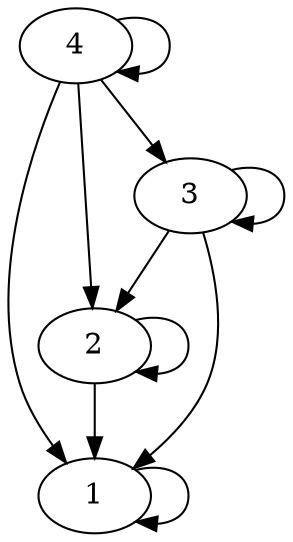
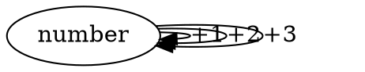

# Basic Categories

## 0 Object Category

```graphviz
```

No object means no morphisms.

## Free Category

Imagine a graph with nodes:
1. For each node, create an identity node.
2. For each pair of composable arrows, create an arrow directly between the objects. This step repeats for each arrow generated.

Free Category is category generated by following the above steps on a directed graph.

## Preorder Category

A category where morphisms represent a relation such as >= or <=.

```graphviz
digraph LessThanOrEqualTo {
  1 -> 1
  1 -> 2
  1 -> 3
  1 -> 4
  2 -> 2
  2 -> 3
  2 -> 4
  3 -> 3
  3 -> 4
  4 -> 4
}
```



Checking if it's a category:
1. Does each object have identity morphism? YES
1. Does each pair of composable arrows have a direct arrow? YES
1. Is composition associative? YES

Preorder: Relation which is reflexive and transitive.

Reflexive: Every element in set has relation to istelf

Transitive: If A has relation with B and b has relation with C, then A has relation with C

Partial Order: Preorder where if A has relation with B and B has relation with A, then A is equal to B.

Total Order: Partial order where every element is related to every other element.

## Thin Category
A category where there is at most one morphism from one object to another.

Example: Preorder

Set of morphisms from A to B in cateogry C is called hom-set, or C(a, b). Every hom-set in preorder is either empty or contains 1 element.

You can have cycles in preorder, but not in partial order. TODO: PROVE

## Monoid Category
A set with a binary operation. Operation must be associative and there must be a unit element (0, empty list, etc.).

Monoid Typeclass
```
trait Monoid[T] {
    def unit: T
    def op(a: T, b: T): T
}
```

There is no way to express monoidal properties of associativity or unit. Programmer must get it right.

```
object Monoid {
    implicit val stringMonoid: Monoid[String] = new Monoid[String] {
        def unit: String = ""
        def op(a: String, b: string): String = a + b
    }
}
```

Extensional equality: for equal inputs, the outputs of two functions are the same. Point-wise equality because arguments are called points.

Morphism equality: two arrows are the same. Point free arguments because no mention of arguments.

A monoid is a single object category where all arrows are identity morphisms which compose.



The hom-set of category M with object m, M(m, m) is all the morphisms from m to itself.

# References
https://eli.thegreenplace.net/2018/partial-and-total-orders/
