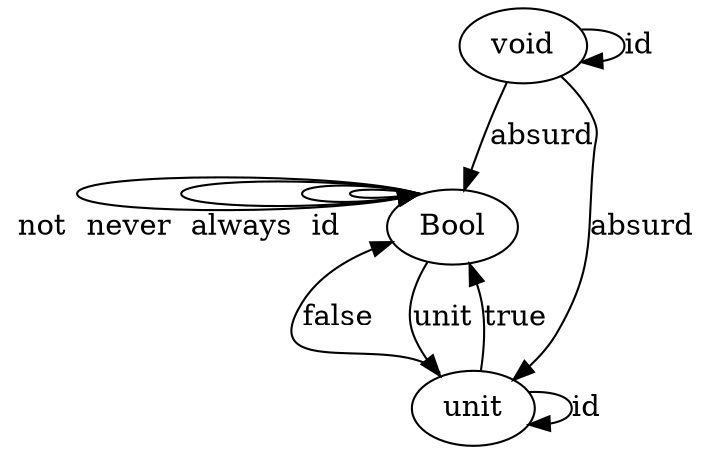
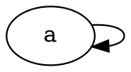
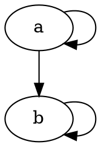
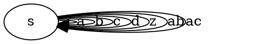
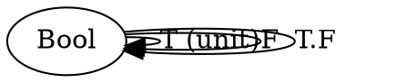
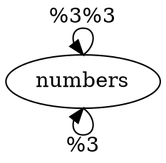
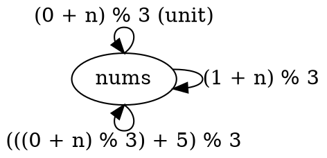
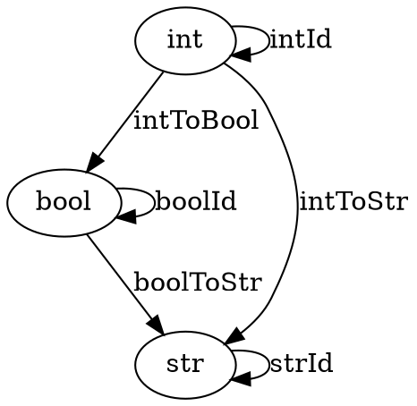

# 1.4
## 1 

```
scala> def identity[A](a: A): A = a
identity: [A](a: A)A
```

## 2

```
scala> def compose[A, B, C](f: A => B, g: B => C): A => C = (a: A) => g(f(a))
compose: [A, B, C](f: A => B, g: B => C)A => C
```

## 3

```
// Define three composable functions
scala> def stringToNumber(s: String): Int = 5
stringToNumber: (s: String)Int

scala> def numberToBoolean(n: Int): Boolean = false
numberToBoolean: (n: Int)Boolean

scala> def booleanToList(b: Boolean): List[Int] = List.empty
booleanToList: (b: Boolean)List[Int]

// Test associativity
scala> compose(compose(stringToNumber, numberToBoolean), booleanToList)("") == compose(stringToNumber, compose(numberToBoolean, booleanToList))("")
res0: Boolean = true

// Test identity

// f o idA == f 
scala> compose(stringToNumber, identity[Int])("") == stringToNumber("")
res2: Boolean = true

// idB o f == f
scala> compose(identity[String], stringToNumber)("") == stringToNumber("")
res4: Boolean = true
```

## 4

The world wide web is a category. Computers can be viewed as objects and network connections as morphisms. 

Links can be viewed as morphisms between webpages (objects)

## 5

Facebook friendships are not categories. If A is frineds with B and B is friends with C, A is not friends with C.
## 6 (CHECK)

A directed graph is a category when:
* Every item has a path to itself
* If there is a path between A and B, then there is a direct path from A to B.

# 2.7
## 1
```
def memoize[K, V](f: K => V): K => V = {
  val cache = collection.mutable.Map.empty[K, V]

  k =>
    cache.getOrElse(k, {
      cache update(k, f(k))
      cache(k)
    })
}
```


## 2
```
val r = scala.util.Random

val memoNextInt = memoize(r.nextInt)
memoNextInt(100) // expression will always give same answer
```
It does not work, since the function no longer behaves expectedly.

## 3
```
?
```

## 4 
The only pure function is a. The rest stop working correctly when memoized.

## 5
Bool has a set of 2 items, {true, false}.
There are 27 combinations of functions that cam map from Bool to Bool.
Since Bottom is an implicit type on that function, you have to consider it as well.
There are some functions that cannot be implemented. The only functions that can not return a bottom are ones that always return true or false, so 2.

```
T -> T   T -> T   T -> T
F -> T   F -> F   F -> B
B -> B   B -> B   B -> B

T -> F   T -> F   T -> F
F -> T   F -> F   F -> B
B -> B   B -> B   B -> B

T -> B   T -> B   T -> B
F -> T   F -> F   F -> B
B -> B   B -> B   B -> B

T -> T            T -> F
F -> T            F -> F
B -> T            B -> F
```

```
val first = (b: Boolean) => true
val second = (b: Boolean) => !b
val third = (b: Boolean) => if (b) true else ???
val fourth = (b: Boolean) => b
val fifth = (b: Boolean) => false
val sixth = (b: Boolean) => if (b) false else ???
val seventh = (b: Boolean) => if (!b) true else ???
val eighth = (b: Boolean) => if (!b) false else ???
val ninth = (b: Boolean) => ???
val tenth = true
val eleventh = false
```

## 6

### First Try
```
Input
       Void     Unit     Bool
Void   absurd   absurd   absurd
Unit    err     sideEff  predicate
Bool    err     sideEff  predicate
```
Apparently, there is this great tool called Graphviz that you can use to create graphs.
After comparing solutions, this is better:


Lessons learned: there can be more than one morphism going from an object to itself. There can also be more than one morphism going from an object to another object.

Must also follow the rules of composition.

# 3
## 1
### a


### b
Same as a?

### c

### d


## 2
### a
Does a set include itself? YES
Is it associative? YES
  A included in B and B is included in C,
  then A is included in C
Does every set have relation with each other? NO
  Two sets can not be included in each other.

Definitely preorder because it's reflexive and transitive.
Also partial order because if A includes B and B includes A, then they must be the same.
Not total order because not all elements must be related.
PARTIAL ORDER.

### b
TODO

## 3
AndMonoid
* Unit: && true
* Operation: && is associative. (true && false) && false is the same as true && (false && false).

OrMonoid
* Unit: || false
* Operation: || is associative. (true || false) || false is the same as true || (false || false)

## 4


Morphisms:
* && true: T
* && false: F

Rules of composition:
* Associative
* Identity is && true

## 5
Category of Modulo 3
* Objects? Numbers
* Morphisms? % 3



* Didn't read that problems was for <i>addition</i> modulo 3.

Object is set of numbers {0, 1, 2}
* (0 + 10) % 3 => 1
* (2 + 13) % 3 => 2


# 4.4
## 1.


Composition can be defined by the following steps:
1. Perform operation on input.
1. If return is None, stop execution. If return is Some, unwrap value and pass it to the next operation.
1. Return the result of the second operation.

Identity is returning the same value wrapped in a Some.
## 2.
```
val safeReciprocal: Double => Option[Double] = {
    case 0 => None
    case other => Some(1.0 / other)
}
```
## 3.
```
val safeRoot: Double => Option[Double] = {
    case n if n < 0 => None
    case n => Some(scala.math.sqrt(n))
}

def compose[A, B, C](f: A => Option[B], g: B => Option[C]) = {
  (a: A) => {
    f(a) match {
      case None => None
      case Some(r) => g(r)
    }
  }
}

val safeReciprocalRoot = compose(safeReciprocal, safeRoot)
```

```
@ safeReciprocalRoot(0)
res25: Option[Double] = None

@ safeReciprocalRoot(-5)
res26: Option[Double] = None
```


# References
https://stackoverflow.com/questions/18716804/27-different-bool-to-bool-values-in-haskell
