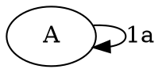
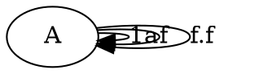
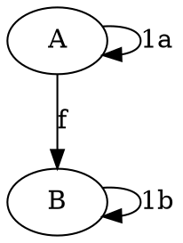
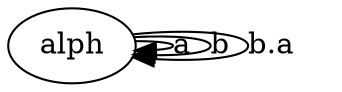
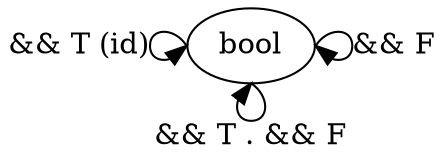
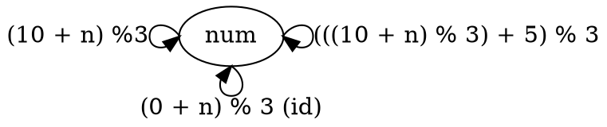

# Chapter 3 Challenges

1. Generate a free category from:

a) Graph with one node and no edges

b) Graph with one node and 1 edge

c) Graph with two nodes and single arrow between them

d) Graph with 1 node and all letters of alphabet as arrows

2. What kind of order is this?
a) Set of sets with inclusion relation

{{1}, {1, 2}, {1, 2, 3}, {2}}

Reflexive: YES
Transitive: YES
Anti-symmetric: YES
Every element in relation?: NO

Partial Order

b) C++ types with relation: T1 R T2 if pointer to T1 can be passed to function expecting T2
{Dog, Cat, Pet, Animal}

Reflexive: YES
Transitive: YES
Anti-symmetric: YES
Every element in relation?L YES (Object type)

Total order

3. Bool is set {true, false}. Show it forms two monoids for operators: && and ||

&&
* Operator is associative: T && (T && F) == (T && T) && F 
* Identity: && T

||
* Operator is associative: T || (T || F) == (T || T) || F 
* Identity: || F 

4. Represent bool and && as category

5. Represent addition module 3 as category
