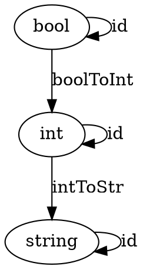

# Kleisli Categories

Can model types and functions in categories. Can also model effects.

A function is pure if the memoized version works the same way.

## Handling Effects
### Naiive
```
var logger = ""

def negate(b: Boolean): Boolean = {
    logger += "Not so!"
    !b
}
```
### Pure, but taking string and returning tuple
```
def negate(b: Boolean, logger: String) = {
    (!b, logger + "Not so!")
}
```

This function no longer composes since the output of this one doens't match the input of the next one.

### Pure, function doesn't handle concatenating
```
type  Writer[T] = (T, String)

def negate(b: Boolean): Writer[Boolean] = {
    (!b, "Not so!")
}

def compose[A, B, C](a: A => Writer[B], b: B => Writer[C]) = {
    (first: A) => {
        val aResult = a(first)
        val bResult = b(aResult._1)
        (bResult._1, aResult._2 + bResult._2)
    }
}
```

Caller of function must worry about creating logger.

## Writer Category
Embellishing return of function to pass along additional context.

Start with Hask. Objects are types, morphisms are <i>embellished</i> functions. Morphisms are still considered to go from one type to another.

Composing embellished functions:
1. Execute emebllished function corresponding to first morphism.
1. Extract ._1 of pair, pass it to second morphism.
1. Concatenate ._2 of both pairs.
1. Return new pair with result of second morphism and concatentation of the ._2 fields.

Can create compose function like above, which defines how functions are composed.



```
def boolToInt(b: Boolean): Writer[Int] = (5, "b->i")
def intToStr(i: Int): Writer[String] = ("hi", "i->s")
def boolId(b: Boolean): Writer[Boolean] = (!b, "")
def intId(i: Int): Writer[Int] = (i + 1, "")
def strId(s: String): Writer[String] = (s + "a", "")
```

Note that id morphisms do not have to return the same value, just the same type. They can't compose like regular function composition, but they can compose with our special `compose` function.

```
compose(boolToInt, intToStr)(true)
```

As long as the types match up, the compose function will handle the log concatenation.

Our process of appending does not have to be limited to string concatenation. So long as the types being composed can define how they should be composed, it will work.

Define compose using "fish" operator:
```
def >=>[A, B, C](m1: A => Writer[B], m2: B => Writer[C]): A => Writer[C] = (first: A) => {
        val aResult = a(first)
        val bResult = b(aResult._1)
        (bResult._1, aResult._2 + bResult._2)
    }
```

To make the operator infix, we can do this:
```
object kleisli {
    //allows us to use >=> as an infix operator
    implicit class KleisliOps[A, B](m1: A => Writer[B]) {
        def >=>[C](m2: B => Writer[C]): A => Writer[C] = x => {
            val (y, s1) = m1(x) val (z, s2) = m2(y) (z, s1 + s2)
        }
    }
```

Identity
```
def pure[A](x: A): Writer[A] = (x, "")
```

Kleisli cateogries are based on monads. They define composition for "embellished" morphisms.

Ability to define composition provides another degree of freedom.