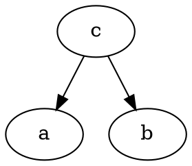
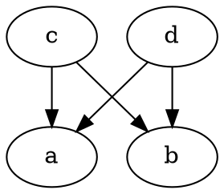
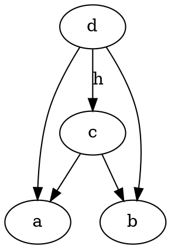
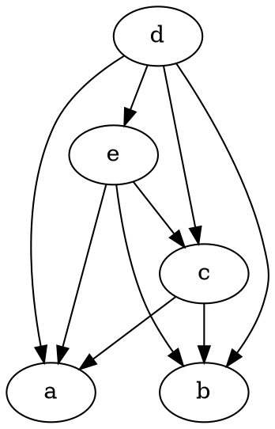
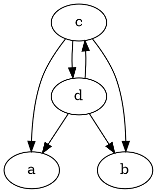
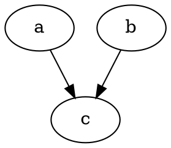

# Product

Categorical product __candidate__ is any object with 2 morphisms going to different objects.


In a category, there will usually be many such objects.


There is a ranking between the candidates. Let's drop down into __Set__ category and look at why.

Take two integer sets, A and B. _Product_ of these two sets is the Cartesian Product

  {..., -2, -1, 0 1, 2, ...}
x {..., -2, -1, 0 1, 2, ...}
= {..., (-2, -2), (-2, -1), ...}

We can view the product as object _c_ and the sets as objects _a_ and _b_. Another set that has arrows going into _a_ and _b_ is a set with size 3 tuples
{..., (-2, -2, 0), (-2, -1, 1), ...}
We can call this _d_.

_d_ has a mapping into _c_; we can just ignore the third item in tuple.


In this case, object c is _better_ in some sense. It doesn't contain unnecessary information. So the product is a categorical product that also has a unique morphism coming from every other categorical product.


_e_ is not the product because it does not have a morphism coming from _c_.

The defintion for product breaks down when isomorphisms are introduced:

Both _c_ and _d_ fit the definition for the product. We deal with this by saying the definition of product holds _up to isomorphism_, since in a sense c and are equivalent.

An example could be two Cartesian products, but with the pairs reversed. In some sense, they are identical too.

What about no morphisms going from _c_ to _d_?


In this case, there is no product.
# Coproduct
Dual of product.


# Hask
Product of types is a pair
```
case class AB(a: string, b: Int)
val c = AB("a", 5)
c.a // morphism from c to a
c.b // morphism from c to b

case class BA(b: Int, a: string) // isomorphic to AB
```

Coproduct of types is Either type.
```
type Coproduct = Either[String, Int]
Left("a") // morphism from a to c
Right("b") // morphism from b to c

type IsoCoproduct = Either[Int, String] // isomorphic to Coproduct
```

# Asymmetry
Although dual definitions are easy to define, the represent different concepts. Reasons are:
* Function might not cover whole codomain
* Function might collapse elements