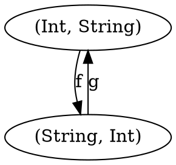

# Algebraic Data Types

## Product
```
case class Pair(a: Int, b: String)
```
Commutative up to isomorphism.



```
case class A(a: Int, b: String)
case class APrime(b: String, a: Int)

def f(a: A): APrime = APrime(a.b, a.a)
def g(aPrime: APrime): A = A(aPrime.b, aPrime.a)
```

Tuple can be interpreted as nested pairs. Also commutative up to isomorphism.

```
case class PairOne(a: Int, b: String)
case class PairTwo(c: Double, d: PairOne)
// equivalent to
case class PairThree(b: String, c: Double);
case class PairFour(a: Int, b: PairThree)

def alpha(p: PairTwo): PairFour = PairFour(p.a, PairThree(p.d.b, p.d.c))
def alpha_inv(p: PairFour): PairTwo = PairTwo(p.c, PairOne(p.b.b, p.b.c))
```
Can view creation of product type as binary op with unit being Unit. 

Can say __Set__ is monoidal category.

## Sum
```
sealed trait Either[+A, +B]
case class Left[A](v: A) extends Either[A, Nothing] case class Right[B](v: B) extends Either[Nothing, B]
```
Commutative up to isomorphism. Can also be nested and that is also commutative up to isomorphism.

__Set__ is also monoidal category with respect to coproduct.

Immutability of data structures allows for deconstruction of algebraic data types with pattern matching.

## Algebra
`𝑎 × (𝑏 + 𝑐) = 𝑎 × 𝑏 + 𝑎 × 𝑐`

Types are distributive. Left hand side is `(A, Either[B, C])`. Right hand is `Either[(A, B), (A, C)]`. Can write functions to convert from one to another.

Product (multiplication) and Coproduct(sum) monoidal categories are related and called a _semiring_. Not _ring_ because we can't define subtraction.

```
0          Void
1          Unit
a + b      Either
a * b      Pair
2 = 1 + 1  Bool = true | false
1 + a      Maybe = Nothing | Some a
```

List:
```
sealed trait List[+A]
case object Nil extends List[Nothing]
case class Cons[A](h: A, t: List[A]) extends List[A]
```
Can be defined algabraically: `x = 1 + a * x`

Substituting results in: `x = 1 + a + a*a + a*a*a + a*a*a*a...`, which is a sum of all combinations of A along with Unit.

Can also view types in terms of logic
```
false       Nothing
true        Unit
a || b      Either
a && b      Pair
```

_and_ and _or_ also form semiring.

Basis for Curry-Howard isomporphism.