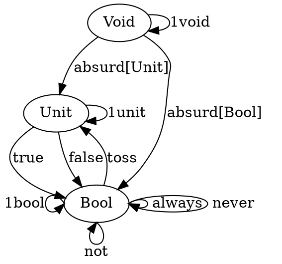

# Chapter 2 Challenges

1. Define function called memoize. Takes pure function f and returns memoized function.

```
def memoize[A, B](f: A => B): A => B = {
    val map = scala.collection.mutable.HashMap[A, B]()

    (a: A) => map.get(a) match {
        case Some(v) => v
        case None => {
            val memo = f(a)
            map.put(a, memo)
            memo
        }
    }
}

def longFunction(secs: Int): Int = {
    Thread.sleep(secs * 1000)
    secs
}

val memoLongFunction = memoize(longFunction)

memoLongFunction(3) // took 3 seconds
memoLongFunction(3) // instant
```

2. Try to memoize random number function. Does it work?
```
val memoRandom = memoize(scala.util.Random.nextInt)

scala.util.Random.nextInt(100) // 34
scala.util.Random.nextInt(100) // 91

memoRandom(100) // 81
memoRandom(100) // 81
```

NO

3. Implement a function that takes a seed, calls random number generator, with the seed and returns result. Does the memoized version work?
```
def randomWithSeed(seed: Int): Int = (new scala.util.Random(seed)).nextInt(100)

val memoRandomWithSeed = memoize(randomWithSeed _)

randomWithSeed(5) // 87
randomWithSeed(5) // 87

memoRandomWithSeed(5) // 87
memoRandomWithSeed(5) // 87

```

YES

4. Which of the functions are pure?
a) Factorial: Yes
b) getChar: No
c) Function with cout: No
d) Function with static: No

5. How many different functions from Bool to Bool?

Not taking into account `_|_`, there are 4.

```
type B = Boolean => Boolean

val always: B = b => true
val never: B = b => false
val identity: B = b => b
val not: B = b => !b
```

6. Draw category with Void, Unit, and Bool along with morphisms. Label them.
