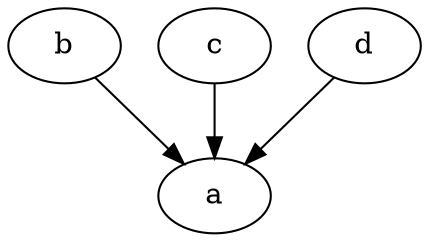
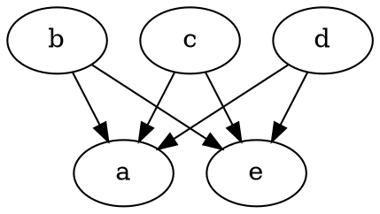
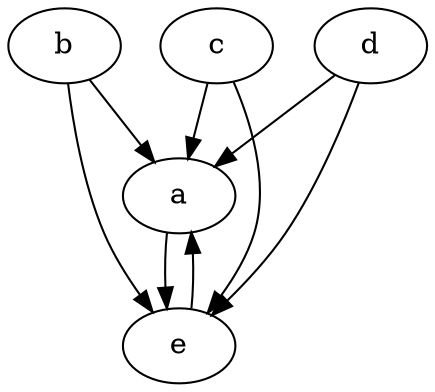
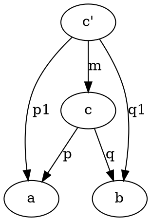
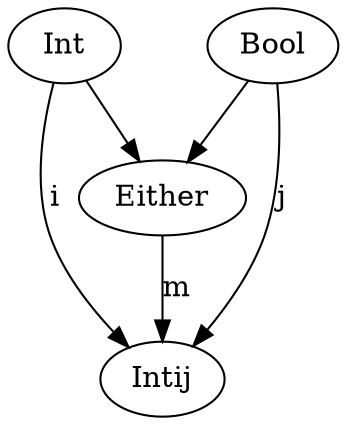

# Chapter 5 Challenges

1. Show terminal object is unique up to unique isomorphism.

Definition of a termainl object is an object that has 1 incoming arrow from every other object.



Let's assume that terminal object is not unique. That means that there is another object that has arrows from other objects.



But to be terminal object, they must also have arrows coming from each other.

The arrows between a and e are isomorphisms since their composition is identity. This proves that any two terminal objects are isomorphic. We also know that isomporphism must be unique as a terminal object can only have 1 incoming arrow.

2. What is product of two objects in poset (partially ordered set)? Use universal construction.

Partial order:
* Reflexive: every element is related to itself
* Transitive: if a R b and b R c, then a R c
* Antisymmetric: if a R b and b R b, then a == b


Let:
* a = 1
* b = 2
* c = 3
* c1 = 4

and morphism means is >=. Both c and c1 are bigger than and b, but c is the smallest number bigger than both of them.

3. What is a coproduct of two objects in poset?
In above poset, coproduct would be greatest number that's smaller than _a_ and _b_. Also, it's the product in the opposite category.

4. Implement Either as generic type.
```
trait Either[+A, +B]
case class Left[+A](a: A) extends Either[A, Nothing]
case class Right[+B](b: B) extends Either[Nothing, B]

val fun = (aOrB: Either[Int, String]) => "hi"
fun(Left(5))
fun(Right(""))
```

5. Show Either is better coproduct than int with:
* int i(int n) { return n; } 
* int j(bool b) { return b ? 0: 1; }

Either is a better coproduct is there exists a function m from Either to the above

```
def m(intOrBool: Either[Int, Bool]): Int = {
    case Left(n) => n
    case Right(b) => b ? 0 : 1
}
```


c1 is int with i and j functions. c is Either. Since there is a way to map from Either to int with projections, Either is "better" coproduct.

6. Why can int with projections not be bettern than either?

Need to show there doesn't exist a unique morphism from Intij to Either
```
case class Intij(n: Int) {
    def i(n: Int) => n
    def j(b: Bool) => b ? 0 : 1
}

def mPrime(intij: Initij): Either[Int, Bool] = {
    case 0 => /* Not sure if came from i(0) or j(true) */
    case 1 => /* Not sure if came from i(1) or j(false) */
    case n => Left(n)
}
```

7. What about these projections?
```
int i(int n) {
    if (n < 0) return n; return n + 2;
}
int j(bool b) { return b ? 0: 1; }
```

```
def mPrime(intij: Initij): Either[Int, Bool] = {
    case 0 => Right(true)
    case 1 => Right(false)
    case n => Left(n)
}
```
Since there exists a unique function m', then Either and Intij would both be coproducts, meaning they are isomorphic.

8. Come up with inferior coproduct that has multiple morphisms to Either.

```
int i(int n) {
    if (n < 0) return n; return n + 3;
}
int j(bool b) { return b ? 0: 1; }

def mPrimeOne(intij: Initij): Either[Int, Bool] = {
    case 0 => Right(true)
    case 1 => Right(false)
    case 2 => Right(true)
    case n => Left(n)
}

def mPrimeOne(intij: Initij): Either[Int, Bool] = {
    case 0 => Right(true)
    case 1 => Right(false)
    case 2 => Right(false)
    case n => Left(n)
}
```