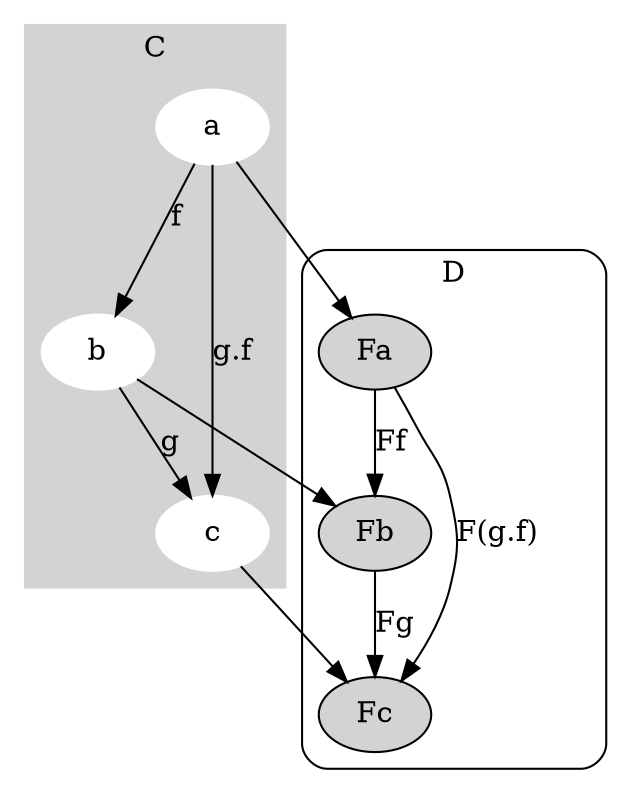

# Functor

Functor is a mapping between categories.


Functor properties:
* Each object in category C has corresponding object in category D.
* Each morphism f: X -> Y has corresponding morphism F(f): F(x) -> F(y) with the following reqs:
    * F(id<sub>x</sub>) = id<sub>F(x)</sub> for each X in C.
    * F(g.f) = F(g).F(f) for all morphisms f: X -> Y and g: Y -> Z in C.

## Example of mapping between categories that's a functor
Imagine the following functor:
```
trait Functor[F[_]] {
    def fmap[A, B](f: A => B): F[A] => F[B]
}

trait Option[+A]
case object None extends Option[Nothing]
case class Some[A](a: A) extends Option[A]

val optionFunctor = new Functor[Option] {
    def fmap[A, B](f: A => B): Option[A] => Option[B] = {
        case None => None
        case Some(x) => Some(f(x))
    }
}
```
This is the typical Option functor. Does it follow the functor laws?
* Does each object in type A have a corresponding Option[A]? Yes.
* Does each function from A to B have a corresponding Option[A] to Option[B]? Yes.
    * `val f = (i: Int) => "hello"`
    * `optionFunctor.fmap(f) // Option[Int] => Option[String]`
* Does the generated function preserve identity?
    * `def id[A](a: A) = a`
    * `optionFunctor.fmap(id[Int])(Some(5)) == id(Some(5)) // true`
* Does the generated function preserve composition?
    * `def f = (i: Int) => "hello"`
    * `def g = (s: String) => true`
    * `optionFunctor.fmap(g compose f)(Some(5)) == (optionFunctor.fmap(g) compose optionFunctor.fmap(f))(Some(5))`

## Example of mapping between categories that's not a functor
Let's modify the optionFunctor above:
```
val optionFunctor = new Functor[Option] {
    def fmap[A, B](f: A => B): Option[A] => Option[B] = {
        case None => None
        case Some(_) => None
    }
}
```
Does the above still hold true?

* ...
* Does each function from A to B have a corresponding Option[A] to Option[B]? Yes.
    * `val f = (i: Int) => "hello"`
    * `optionFunctor.fmap(f) // Option[Int] => Option[String]` 
* Does the generated function preserve identity?
    * `def id[A](a: A) = a`
    * `optionFunctor.fmap(id[Int])(Some(5)) == id(Some(5)) // false` FAIL
* Does the generated function preserve composition? YES

## Reader
Consider the following pattern
* a => Option[A]
* a => List[A]
* a => (R => A)

The last one represents the Reader Functor. Let's look at the Functor laws:
