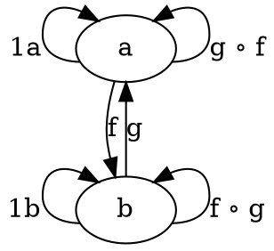
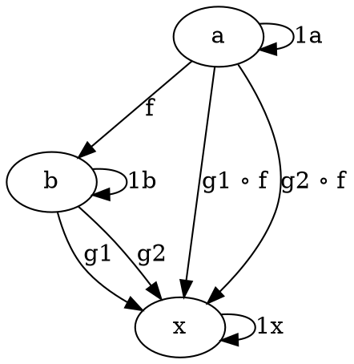
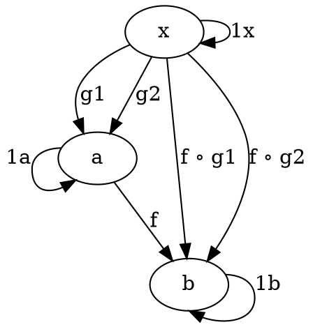

# Morphism

Morphism is a mapping between objects called __source__ and __target__ objects.

__Domain__ of function is set of possible inputs

__Codomain__ of function is set of possible outputs

__Image__ of function is set of actual outputs; subset of codomain

A function _f_ where _f(x) = y_ is __invertible__ if there exists a function _g_ where _g(y) = x_ for all y.
To be invertible, each _x_ must have exactly 1 corresponding _y_.

## Types
Morphism _f: a -> b_ is a:
* __isomorphism__ if there exists a morphism _g: b -> a_ such that _f ∘ g = 1b_ and _g ∘ f = 1a_
    * Reason 1 not to be isomorphism: elements are _collapsed_, which makes it not invertible. (ex: isEven) (i.e abstraction)
        * If morphism _doesn't_ collapse, it's __injective__ or __monic__.
    * Reason 2 not to be isomorphism: image does not fill codomain. (ex: numToStr) (i.e. modeling)
        * If morphism's image _does_ fill codomain, it's __surjective__ or __epic__
    * Morphism _is_ isomorphism if it's _injective_ and _surjective_

* __epimorphism__ if g1 ∘ f = g2 ∘ f implies g1 = g2 for all morphisms g1, g2 : b -> x
    * _epic_ morphism, meaning image fills codomain
    * example:
        * f: numToStr
        * g1: if numStr, prepend "num", else prepend "str"
        * g2: prepnd "num"
        * g1 != g2. But g1 ∘ f = g2 ∘ f. Therefore, f is not epimorphism; it doesn't fill codomain of String type

* __monomorphism__ if f ∘ g1 = f ∘ g2 implies g1 = g2 for all morphisms g1, g2 : x -> a
    * _monic_ morphism, meaning morphism doesn't collapse items.

