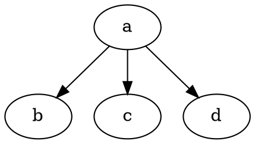
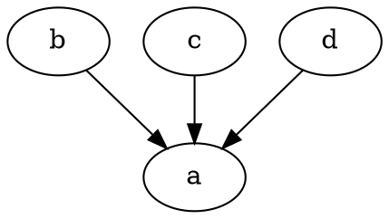
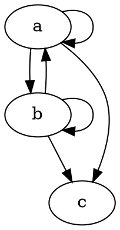

# Initial Object

Unique object with exactly 1 morphism going to every object in category.

# Terminal Object

Dual of Initial object:
* Initial object in opposite category
* Unique object with exactly 1 morphism coming in from every object in category.

# Isomorphisms
How do we know that initial object is unique?

Objects a and b both have exactly 1 morphism coming from every object. But they are isomorphic, so we say that the above definitions are true _up to isomorphism_ since in some sense, a and b are equivalent. 2 initial object will always be isomorphic by defintion since they will have arrows going into each other.